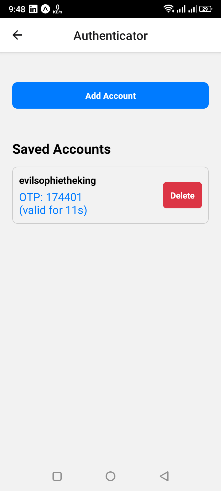

# Authenticator App

A simple and secure 2-factor authenticator app built with React Native and Expo.

## Features

- **Generate TOTP Codes:** Generate time-based one-time passwords (TOTP) for your online accounts.
- **Add Accounts Manually:** Manually add accounts by providing a secret key.
- **Scan QR Codes:** Easily add accounts by scanning a QR code.
- **Secure Storage:** Your secret keys are stored securely on your device.

## Tech Stack

- **React Native:** A framework for building native apps using React.
- **Expo:** A platform for making universal React applications.
- **TypeScript:** A typed superset of JavaScript that compiles to plain JavaScript.

## Getting Started

To get a local copy up and running, follow these simple steps.

### Prerequisites

- Node.js
- npm
- Expo Go app on your mobile device

### Installation

1. Clone the repo
   ```sh
   git clone https://github.com/OlyMahmudMugdho/authenticator.git
   ```
2. Install NPM packages
   ```sh
   npm install
   ```
3. Start the app
   ```sh
   npx expo start
   ```
4. Click add account then, Scan the QR code with the Expo Go app on your phone.

## Screenshots

| Home Screen | Add Account |
| :---: | :---: |
|  |  |

## License

Distributed under the MIT License. See `LICENSE` for more information.